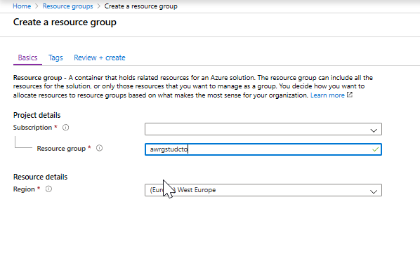
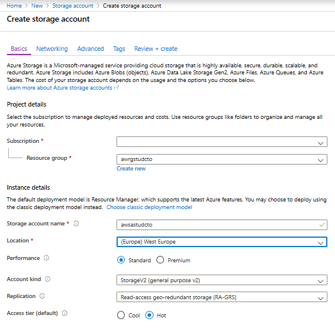
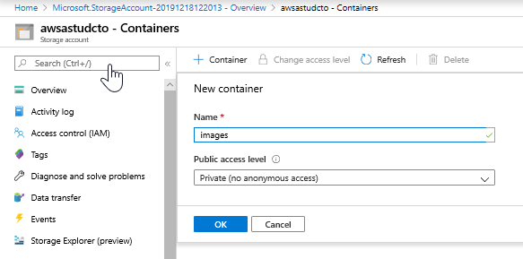
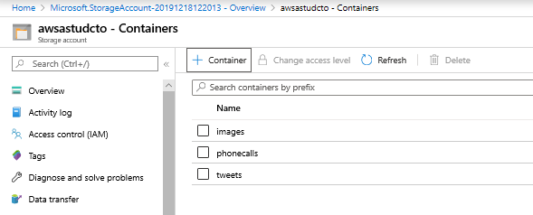
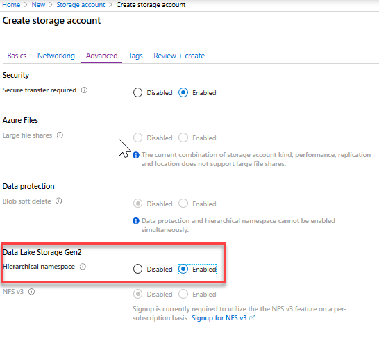
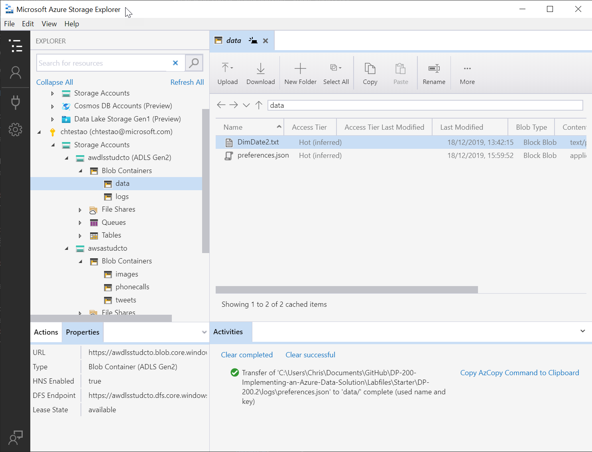

# DP 200 - Implementing a Data Platform Solution
# Lab 2 - Working with Data Storage

**Estimated Time**: 60 minutes

**Pre-requisites**: It is assumed that the case study for this lab has already been read. It is assumed that the content and lab for module 1: Azure for the Data Engineer has also been completed

**Lab files**: The files for this lab are located in the _Allfiles\Labfiles\Starter\DP-200.2_ folder.

## Lab overview

In this lab, the students will be able to determine the appropriate storage type to implement against a given set of business and technical requirements. They will be able to create Azure storage accounts and Data Lake Storage account and explain the difference between Data Lake Storage version 1 and version 2. They will also be able to demonstrate how to perform data loads into the data storage of choice.

## Lab objectives
  
After completing this lab, you will be able to:

1. Choose a data storage approach in Azure
1. Create an Azure Storage Account
1. Explain Azure Data Lake Storage
1. Upload data into Azure Data Lake

## Scenario
  
You have been hired as a Senior Data Engineer to implement a technology solution that is part of a digital transformation project. The organization is migrating an Internet Information Services (IIS) that hosts the company website to Azure. The developers are in the process of transferring the web application and its logic to Azure Web Apps and they have asked you to prepare a data store for them that can be used to host the static images that are used on the website.

In addition, the information services department have informed you that their team is expanding and that they will soon be joined by data scientists that will start the process of building a predictive analytics solution. You have been asked to set up a solution that will be used to host the production environment of their work. In the first instance, you will assess what is the appropriate storage tier to create for the solution.

At the end of this work, you will have:

1. Choosen a data storage approach in Azure
2. Created an Azure Storage Account
3. Explained Azure Data Lake Storage
4. Uploaded data into Azure Data Lake

> **IMPORTANT**: As you go through this lab, make a note of any issue(s) that you have encountered in any provisioning or configuration tasks and log it in the table in the document located at _\Labfiles\DP-200-Issues-Doc.docx_. Document the Lab number, note the technology, Describe the issue, and what was the resolution. Save this document as you will refer back to it in a later module.

## Exercise 1: Choose a data storage approach in Azure

Estimated Time: 15 minutes

Individual exercise
  
The main task for this exercise are as follows:

1. From the case study, identify the data storage requirements for the static images for the website, and for the predictive analytics solution.

1. The instructor will discuss the findings with the group.

### Task 1: Identify the data storage requirements and structures of AdventureWorks.

1. From the lab virtual machine, start **Microsoft Word**, and open up the file **DP-200-Lab02-Ex01.docx** from the **Allfiles\Labfiles\Starter\DP-200.2** folder.

1. Spend **10 minutes** documenting the data storage requirements as outlined in the scenario of this lab. You can also use the case study document for additional reference.

### Task 2: Discuss the findings with the Instructor

1. The instructor will stop the group to discuss the findings.

> **Result**: After you completed this exercise, you have created a Microsoft Word document that shows two tables of data storage requirements.

## Exercise 2: Create an Azure Storage Account
  
Estimated Time: 20 minutes

Individual exercise
  
The main tasks for this exercise are as follows:

1. Create Azure resource group named **awrgstudxx** in the region closest to the lab location, where **xx** are your initials.

1. Create and configure a storage account named **awsastudxx** in the region closest to the lab location within the resource group awrgstudxx, where **xx** are your initials.

1. Create a container named **images**, **phonecalls** and **tweets** within the awsastudxx storage account.

1. Upload some graphics to the images container of the storage account.

### Task 1: Create and configure a resource group.

1. From the lab virtual machine, start Microsoft Edge, browse to the Azure portal at [**http://portal.azure.com**](http://portal.azure.com) and sign in by using the account that has been assigned to you for the course.

1. In the Azure portal, click on the **Resource groups** icon.

1. In the **Resource groups** screen, click on **+ Add** to create the first resource group with the following settings:

    - **Subscription**: the name of the subscription you are using in this lab
    
    - **Resource group name**: **awrgstudxx**, where **xx** are your initials.

    - **Resource group location**: the name of the Azure region which is closest to the lab location and where you can provision Azure VMs.

      > **Note**: To identify Azure regions available in your subscription, refer to [**https://azure.microsoft.com/en-us/regions/offers/**](https://azure.microsoft.com/en-us/regions/offers/)

        

1. In the Create a resource group screen, click on **Review + Create**.

1. In the Create a resource group screen, click on **Create**.

> **Note**: it will take approximately 30 seconds to create a resource group. You can check the notifications area to check when the creation in complete.

### Task 2: Create and configure a storage account.

1. In the Azure portal, at the top left of the screen, click on the **Home** hyperlink

1. In the Azure portal, click on the **+ Create a resource** icon.

1. In the New screen, click in the **Search the Marketplace** text box, and type the word **storage acount**. Click **Storage account - blob, file, table, queue** in the list that appears.

1. In the **Storage account** screen, click **Create**.

1. From the **Create storage account** screen, create the first storage account with the following settings:

    - Under the project details, specify the following settings:

        - **Subscription**: the name of the subscription you are using in this lab
    
        - **Resource group**: **awrgstudxx**, where **xx** are your initials.

    - Under the instance details, specify the following settings:
    
        - **Storage account name**: **awsastudxx**, where **xx** are your initials.

        - **Location**: the name of the Azure region which is closest to the lab location and where you can provision Azure VMs.

        - **Performance**: **Standard**.

        - **Account kind**: **StorageV2 (general purpose v2)**.

        - **Replication**: **Read-access geo-redundant storage (RA_GRS)**

        - **Access tier (default)**: **Hot**.

            

1. In the **Create storage account** screen, click **Review + create**.

1. After the validation of the **Create storage account*** screen, click **Create**.

   > **Note**: The creation of the storage account will take approximately 90 seconds while it provisions the disks and the configuration of the disks as per the settings you have defined.

### Task 3: Create and configure a container within the storage account.

1. In the Azure portal, a message states that _Your deployment is complete_, click on the button **Go to resource**.

1. In the **awsastudxx** screen, where **xx** are your initials, under the **Blob Service** click **Containers**.

1. In the **awsastudxx - Containers** screen, at the top left, click on the  **+ Container** button.

1. From the **New Container*** screen, create a container with the following settings:

    - Name: **images**.

    - Public access level: **Private (no anonymous access)**

        

1. In the **New Container** screen, click **OK**.

   > **Note**: The creation of the container is immediate and will appear in the list of the **awrgstudxx - Containers** screen.

1. Repeat steps 4 -5 to create a container named **phonecalls** with the public access level of **Private (no anonymous access)**

1. Repeat steps 4 -5 to create a container named **tweets** with the public access level of **Private (no anonymous access)**. Your screen should look as the graphic below:

    

### Task 4: Upload some graphics to the images container of the storage account.

1. In the Azure portal, in the **awsastudxx - Containers** screen, click on the **images** item in the list.

1. In the **images** screen, click on the **Upload** button.

1. In the **Upload blob** screen, in the Files text box, click on the **folder** icon to the right of the text box.

1. In the **Open** dialog box, browse to  **Labfiles\Starter\DP-200.2\website graphics** folder. Highlight the following files:

    - one.png

    - two.png

    - three.png

    - No.png

1. In the **Open** dialog box, click **Open**. 

1. In the **Upload blob** screen, click on the **Upload** button.

1. Close the **Upload blob** screen, and close the **images** screen.

1. Close the **awsastudxx - Containers** screen, and in the Azure portal, navigate to the **Home** screen. 

   > **Note**: The upload of the files will take approximately 5 seconds. Once completed, they will appear in a list in the upload blobs screen.

> **Result**: After you completed this exercise, you have created a Storage account named awsastudxx that has a container named images that contains four graphics files that are ready to be used on the AdventureWorks website.

## Exercise 3: Explain Azure Data Lake Storage
  
Estimated Time: 15 minutes

Individual exercise
  
The main tasks for this exercise are as follows:

1. Create and configure a storage account named **awdlsstudxx** as a Data Lake Store Gen2 storage type in the region closest to the lab location, within the resource group awrgstudxx, where **xx** are your initials.

1. Create containers named **logs** and **data** within the awdlsstudxx storage account.

### Task 1: Create and configure a storage account as a Data Lake Store Gen II store.

1. In the Azure portal, click on **+ Create a resource** icon.

1. In the New screen, click in the **Search the Marketplace** text box, and type the word **storage**. Click **Storage account** in the list that appears.

1. In the **Storage account** blade, click **Create**.

1. From the **Create storage account*** blade, create a storage account with the following settings:

    - Under the project details, specify the following settings:

        - **Subscription**: the name of the subscription you are using in this lab
    
        - **Resource group name**: **awrgstudxx**, where **xx** are your initials.

    - Under the instance details, specify the following settings:

        - **Storage account name**: **awdlsstudxx**, where **xx** are your initials.

        - **Location**: the name of the Azure region which is closest to the lab location and where you can provision Azure VMs.

        - **Performance**: **Standard**.

        - **Account kind**: **StorageV2 (general purpose v2)**.

        - **Replication**: **Read-access geo-redundant storage (RA_GRS)**

        - **Access tier (default)**: **Hot**.

1. Click on the **Advanced** tab.

1. Under Data Lake Storage Gen2, click **Enabled** under **Hierarchical namespace**.

    

1. In the **Create storage account** blade, click **Review + create**.

1. After the validation of the  **Create storage account*** blade, click **Create**.

   > **Note**: The creation of the storage account will take approximately 90 seconds while it provisions the disks and the configuration of the disks as per the settings you have defined.

### Task 2: Create and configure a Container within the storage account.

1. In the Azure portal, a message states that _Your deployment is complete_, click on the button **Go to resource**.

1. In the **awdlsstudxx** screen, where **xx** are your initials, click **Containers**.

1. In the **awrgstudxx - Containers** screen, at the top left, click on the  **+ Containers** button.

1. From the **New** screen, create two file systems with the following name:

    - Name: **data**.

    - Name: **logs**

1. In the **New Containers** screen, click **OK**.

   > **Note**: The creation of the file system is immediate and will appear in the list of the **awdlsstudxx - Containers** screen as follows.

    

> **Result**: After you completed this exercise, you have created a Data Lake Gen2 Storage account named awdlsstudxx that has a file system named data.

## Exercise 4: Upload data into Azure Data Lake.
  
Estimated Time: 10 minutes

Individual exercise
  
The main task for this exercise are as follows:

1. Install and start Microsoft Azure Storage Explorer

1. Upload some data files to the containers of the Data Lake Gen II Storage Account.

### Task 1: Install Storage Explorer.

1. In the Azure portal, in the **awdlsstudxx - Containers** screen, click on the **data** item in the list.

1. A screen appears stating Azure Data Lake Storage Gen2 is now available in Storage Explorer, click on the **Download Azure Storage Explorer** hyperlink.

1. You are taken to the following web page for [Azure Storage Explorer](https://azure.microsoft.com/en-us/features/storage-explorer/) where there is a button that states **Download now**. click on this button.

1. In the Microsoft Edge dialog box click **Save**, when the download is complete, click on **View downloads**, in the download screen in Microsoft Edge, click on **Open folder**. This will open the Downloads folder.

1. Double click the file **StorageExplorer.exe**, in the User Account Control dialog box click on **Yes**.

1. In the License Agreement screen, select the radio button next to **I agree the agreement**, and then click on **Install**.

   > **Note**: The installation of Storage Explorer can take approximately 4 minutes. Azure Storage Explorer allows you to easily manage the contents of your storage account with Azure Storage Explorer. Upload, download, and manage blobs, files, queues, tables, and Cosmos DB entities. It also enables you to gain easy access to manage your virtual machine disks.

1. On completion of the installation, ensure that the checkbox next to **Launch Microsoft Azure Storage Explorer** is selected and then click **Finish**. Microsoft Azure Storage Explorer opens up and lists your subscriptions.

1. In Storage Explorer, select **Manage Accounts** to go to the **Account Management Panel**.

1. The left pane now displays all the Azure accounts you've signed in to. To connect to another account, select **Add an account**

1. If you want to sign into a national cloud or an Azure Stack, click on the Azure environment dropdown to select which Azure cloud you want to use. Once you have chosen your environment, click the **Sign in...** button.

1. After you successfully sign in with an Azure account, the account and the Azure subscriptions associated with that account are added to the left pane. Select the Azure subscriptions that you want to work with, and then select **Apply**. The left pane displays the storage accounts associated with the selected Azure subscriptions.

    

### Task 2: Upload data files to the data and logs container of the Data Lake Gen II Storage Account.

1. In Azure Storage Explorer, click on the arrow to expand your subscription.

1. Under **Storage Accounts**, search for the storage account **awdlsstudxx (ADLS Gen2)**, and click on the arrow to expand it.

1. Under **Blob Containers**, click on the arrow to expand it and show the **logs** file system. Click on the **logs** file system.

1. In Azure Storage Explorer, click on the arrow next to the **Upload** icon, and click on the **Upload Files..**.

1. In Upload Files dialog box, click on the ellipsis next to the **Selected files** text box.

1. In the **Choose files to upload** dialog box, browse to **Labfiles\Starter\DP-200.2\logs** folder. Highlight the following files:

    - weblogsQ1.log

    - weblogsQ2.log

    - preferences.json

1. In the **Choose files to upload** dialog box, click **Open**.

1. In the **Upload Files** screen, click on the **Upload** button.

   

1. Under **Blob Containers**, click on the arrow to expand it and show the **data** file system. Click on the **data** file system.

1. In Azure Storage Explorer, click on the arrow next to the **Upload** icon, and click on the **Upload Files..**.

1. In Upload Files dialog box, click on the ellipsis next to the **Selected files** text box.

1. In the **Choose files to upload** dialog box, browse to **Labfiles\Starter\DP-200.2\Static Files** folder. Highlight the following files:

    - DimDate2.txt

1. In the **Choose files to upload** dialog box, click **Open**.

1. In the **Upload Files** screen, click on the **Upload** button.

1. Repeat the steps to upload the preferences.JSON file from the **Labfiles\Starter\DP-200.2\logs** folder to the **data** file system in the Data Lake Store gen2

   > **Note**: The upload of the files will take approximately 5 seconds. You will see a message in Azure Storage Explorer that states **Your view may be out of data. Do you want to refresh? Click Yes**. Once completed, all two files will appear in a list in the upload blobs screen.

    

1. In Azure Storage Explorer, in the data file system, click on the **+ New Folder** button.

1. In the New Folder screen, in the New folder name text box, type **output**.

1. Close down Azure Storage Explorer.

1. Return to the Azure portal, and navigate to the **Home** blade.

> **Result**: After you completed this exercise, you have created a Data Lake Gen II Storage account named awdlsstudxx that has a file system named data that contains two weblog files that are ready to be used by the Data scientists at AdventureWorks.
